# Lenovo-R7000-2020-4800H
Lenovo-R7000-2020-4800H-Hackintosh
黑苹果教程

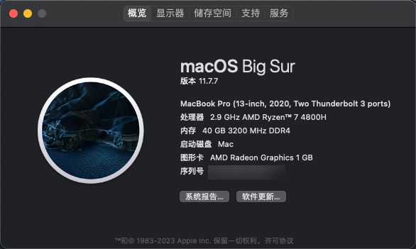

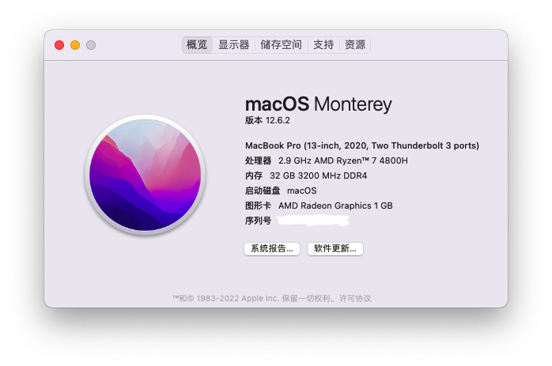

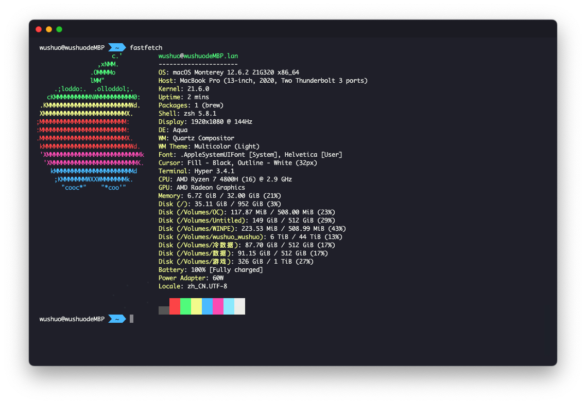 

这是目前联想拯救者R7000/R700P 2020款 4800H处理器的成果

| CPU：4800H                           | yes                  |
| ------------------------------------ | -------------------- |
| GPU：AMD Radeon Graphics             | yes                  |
| WiFi网卡（AX200）                    | maybe                |
| 蓝牙                                 | maybe                |
| 触控板                               | yes                  |
| 隔空投送                             | maybe                |
| 电池                                 | yes                  |
| CPU温度                              | yes                  |
| 声卡（无输入、有输出）Realtek ALC257 | maybe                |
| 随航                                 | no                   |
| USB                                  | 禁用A口一个和C口一个 |

解锁BIOS

联想拯救者需要进行Bios关闭XCHI0 并 将核显显存调整为8G（需要第三方解锁Bios，存在一定风险，Bios版本较高的无法解锁。）

Unlocker.exe 解锁BIOS的高级选项，右键管理员运行即可。解锁后的效果：

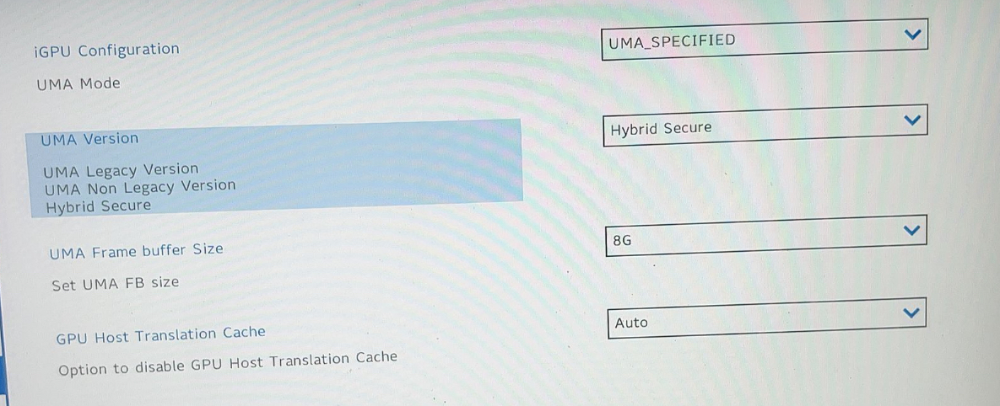

若是没有这两个选项那就说明你的BIOS太新了，需要对BIOS进行降级。

如果有这两个选项你的BIOS就不需要降级了，请略过。

降级有风险！！！请考虑好再试。因降级BIOS时操作不当，导致BIOS电脑无法开机，自行去售后解决。

降级请确认你有一台可以使用HDMI连接的显示器。

在BIOS开启允许降级：

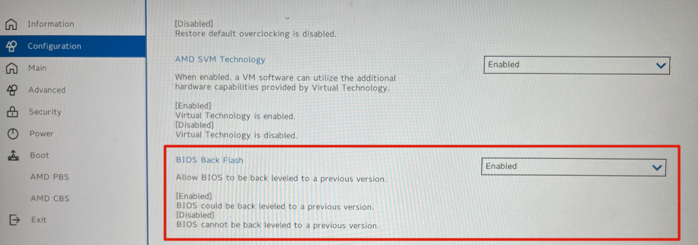

下载需要降级的BIOS进行降级：

https://download.lenovo.com/consumer/mobiles/fscn20ww.exe

右键管理员运行，等待电脑自动重启跑进度条。

等待BIOS降级完成后，如果你的电脑黑屏了请不要慌，请按照以下操作解决：

用HDMI连接外接显示器进入BIOS，你会发现显卡是独显模式。把它改回混合模式即可。

(如果你发现没有模式切换选项多重启一下就会有的，至少我是这么解决的)

现在你再进入系统进行解锁BIOS就可以了

2 设置BIOS

在BIOS中按照以下路径禁用XHCI0：

AMD CBS -> +FCH Common Options -> +USB Configuration Options -> XHCI0 controller enable

(这个操作会使你电脑左侧的USB和屁股的typec被禁用，但这是吃黑苹果必须要做的，至少现在是这样)

按照以下路径与图片设置核显显存（核显似乎对显存的设置有1G的限制）：

AMD CBS -> +NBIO Common Options -> +GFX Configuration

本项目核显需要采用nootedred.kext（https://github.com/ReinierTutoriales/NootedRed.kexts）

EFI已制作完成，分为安装前和安装后，原因是安装前不建议勾选一些模块，会存在一定问题，所以严禁搞混顺序。

由于本机型采用的AX200网卡，需要使用itlwm这个开源项目，官方不建议使用过新的系统版本。详见github项目地址（https://openintelwireless.github.io/itlwm/FAQ.html#installation）

安装过程：

1、采用我们发的Bios解锁工具，对Bios进行操作，切记不要进行其他操作。

 

关闭安全启动-Security > Secure Boot

2、制作安装镜像，建议11.7~12.6.2系统的镜像制作启动盘，

使用 etcher 把 macOS镜像 写入U盘

3、将我们发的安装前 EFI，包括BOOT和OC复制到启动优盘的EFI里面。我采用的是diskgenius（https://www.diskgenius.cn）

4、插入启动U盘，BIOS里调整顺序后进行启动，然后install开始安装，安装过程中，不出意外的话，多次跑码启动后能够进入系统。此时核显仍显示7Mb，是正常的，因为还没有加载核显驱动。

5、使用OpenCore 配置工具挂在本机内已存在的EFI分区，如下：

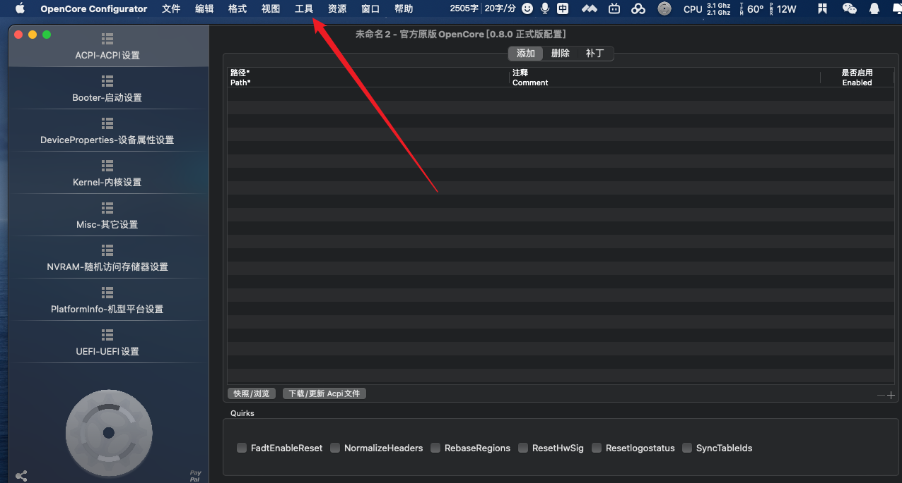

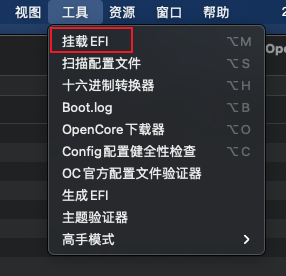

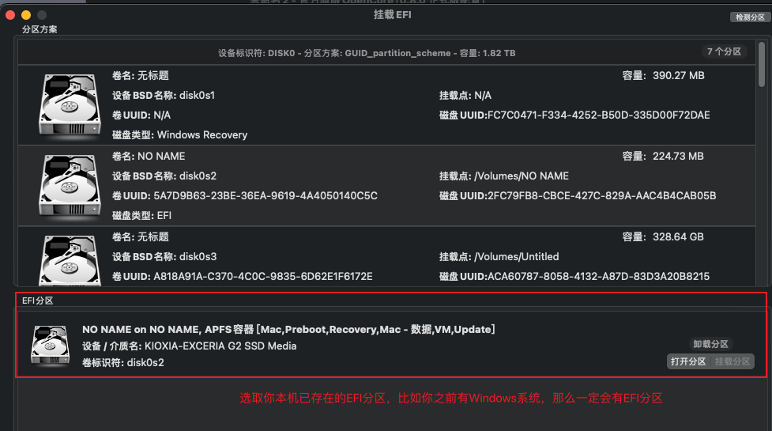

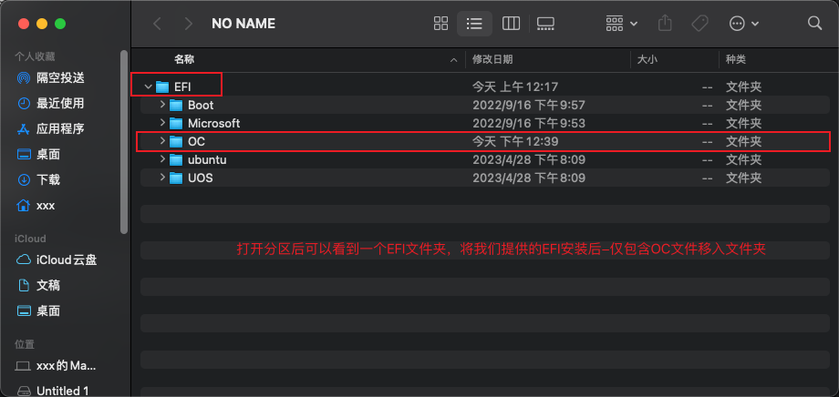

6、重启Windows制作启动项，采用软件如下：

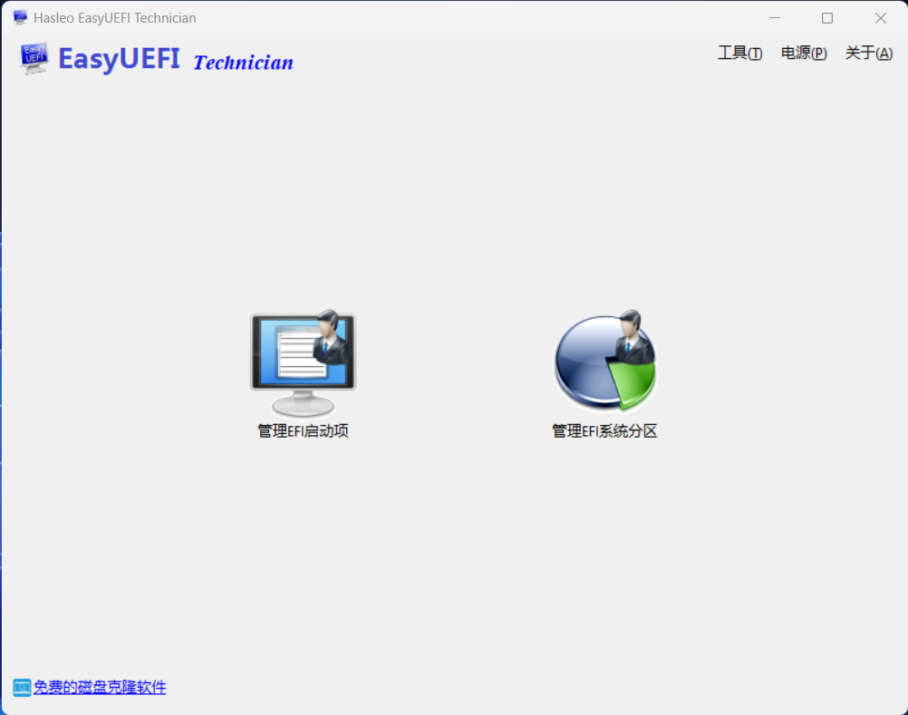

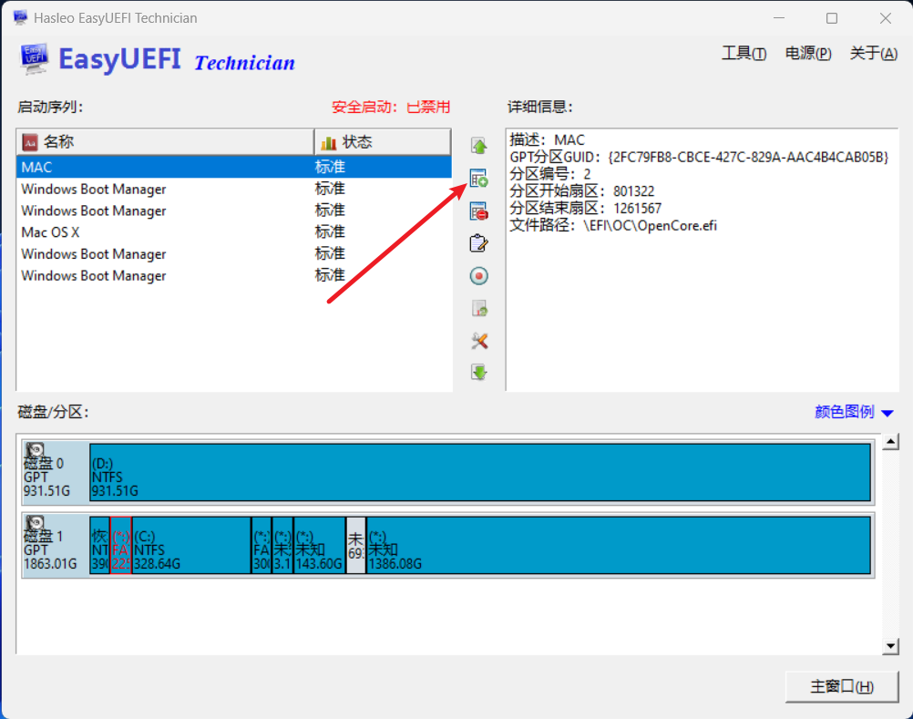

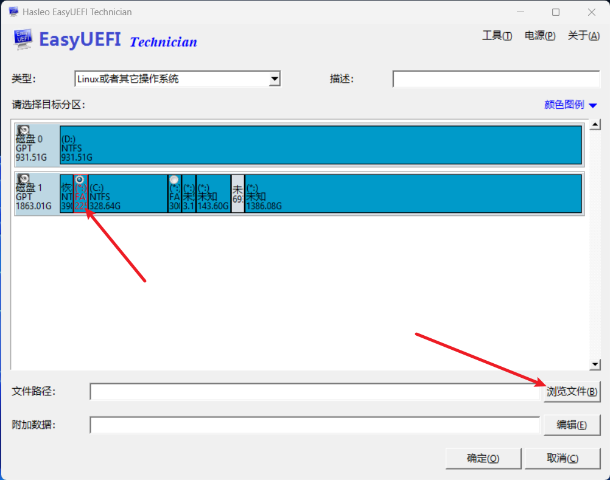

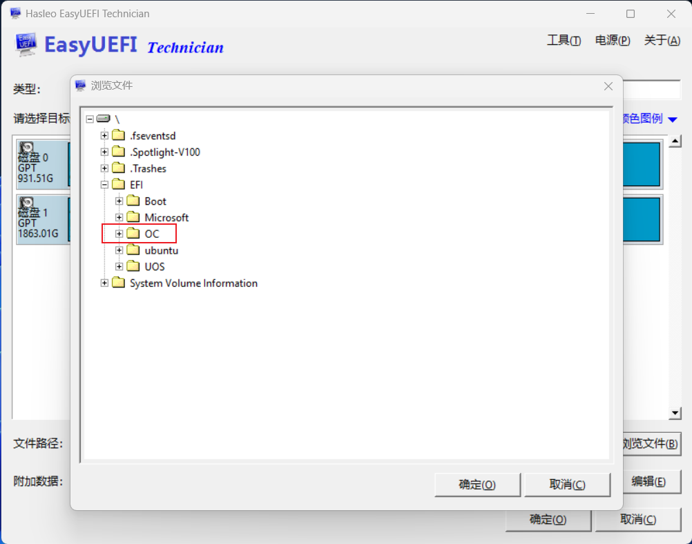

再次重启进入 OpenCore 引导，Reset NVRAM 进入mac

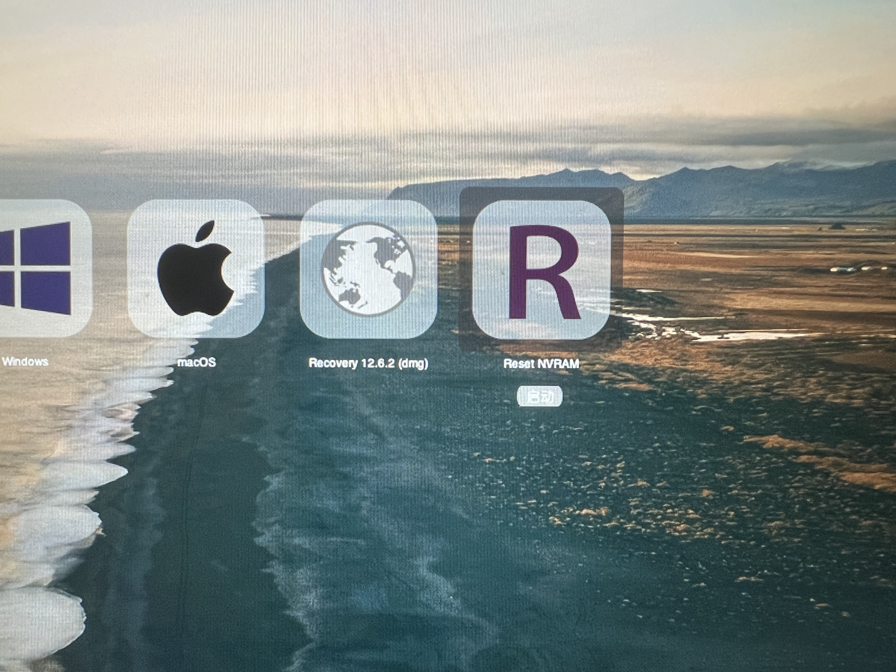

7、然后就可以进入系统了。

链接: https://pan.baidu.com/s/1GIX0pO2hUIEVZh-O0N_azA?pwd=rc6e 提取码: rc6e

留下EFI，自行研究吧
