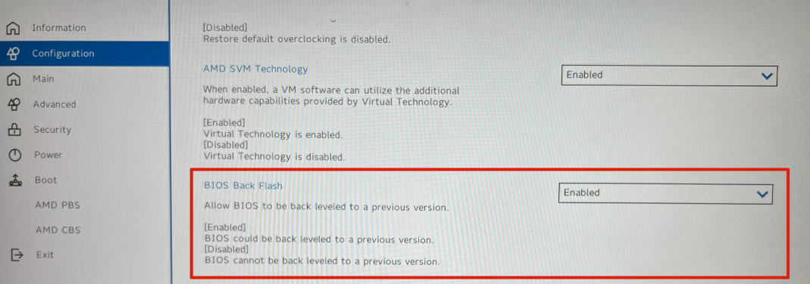
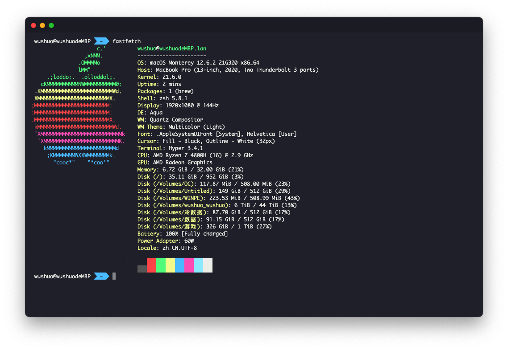

## R7000P 2020 黑苹果

| 名称         | 型号                | 状态                 |
| ------------ | ------------------- | -------------------- |
| 机型         | R7000P / R7000      |                      |
| CPU          | AMD Ryzen™ 7 4800H  | 可用                 |
| 核显         | AMD Radeon Graphics | 可用                 |
| 网卡         | AX200               | 部分可用             |
| 固态         | SN750 4T            | 可用                 |
| 键盘、触控板 |                     | 可用                 |
| 声卡、音频   | Realtek ALC257      |                      |
| 内存         | 三星16G x2          |                      |
| USB          |                     | 禁用A口一个和C口一个 |

### 1 解锁BIOS

安装黑苹果之前需要使用 [Unlocker.exe](https://winraid.level1techs.com/t/tool-lenovo-h20-bios-unlocker-and-locker/38150) 解锁BIOS的高级选项，右键管理员运行即可。解锁后的效果：

若是没有这两个选项那就说明你的BIOS太新了，需要对BIOS进行降级。

如果有这两个选项你的BIOS就不需要降级了，请略过。

#### 1.1 BIOS降级

**降级有风险！！！请考虑好再试**。本人因降级BIOS时操作不当，导致BIOS电脑无法开机，遂去售后**200**块解决(已经过保)。

降级**请确认你有一台可以使用HDMI连接的显示器**。

在BIOS开启允许降级：

下载需要降级的BIOS进行降级：

https://download.lenovo.com/consumer/mobiles/fscn20ww.exe

右键管理员运行，等待电脑自动重启跑进度条。

**等待BIOS降级完成后，如果你的电脑黑屏了请不要慌，请按照以下操作解决**：

用HDMI连接外接显示器进入BIOS，你会发现显卡是独显模式。把它改回混合模式即可。

(如果你发现没有模式切换选项多重启一下就会有的，至少我是这么解决的)

现在你再进入系统进行解锁BIOS就可以了

### 2 设置BIOS

在BIOS中按照以下路径禁用XHCI0：

AMD CBS -> +FCH Common Options -> +USB Configuration Options -> XHCI0 controller enable

(这个操作会使你电脑左侧的USB和屁股的typec被禁用，但这是吃黑苹果必须要做的，至少现在是这样)

按照以下路径与图片设置核显显存（核显似乎对显存的设置有1G的限制）：

AMD CBS -> +NBIO Common Options -> +GFX Configuration

### 3 制作启动盘

使用 [diskgenius](https://www.diskgenius.cn) 划分一个分区(建议最少500m)，格式化为FAT32。把对应的EFI解压到分区即可。

### 4 安装黑苹果

使用 [OCAuxiliaryTools](https://github.com/ic005k/OCAuxiliaryTools) 禁用核显 (每次安装或升级系统都需要禁用)

使用 [etcher](https://github.com/balena-io/etcher) 把 macOS镜像 写入U盘

重启选择启动项 (部分电脑无法自动识别启动项，需要手动到 [diskgenius](https://www.diskgenius.cn) 去 [设置启动项](https://www.baidu.com/s?wd=diskgenius+设置启动项))

安装macOS，结束后**别急着开启核显驱动**。

进入macOS，配置好用户进入桌面。重启进入 pe 或 windows 使用 [OCAuxiliaryTools](https://github.com/ic005k/OCAuxiliaryTools) 启用核显。

再次重启进入 OpenCore 引导，Reset NVRAM 进入mac

